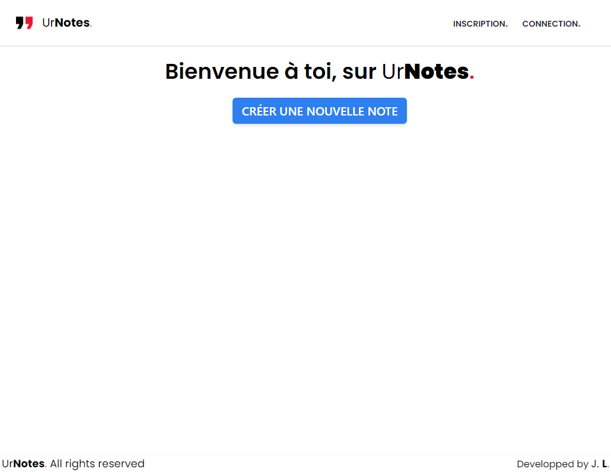
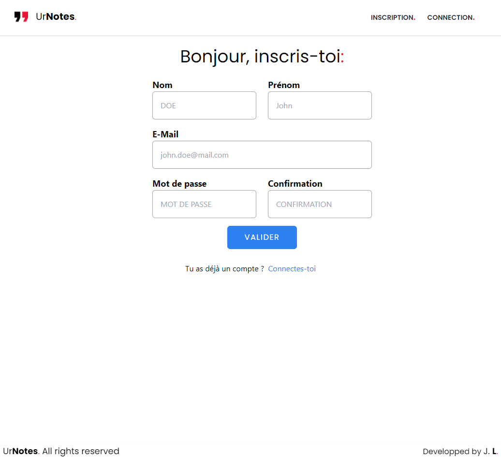
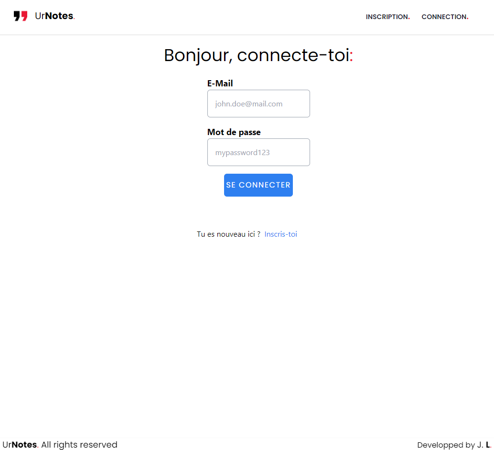
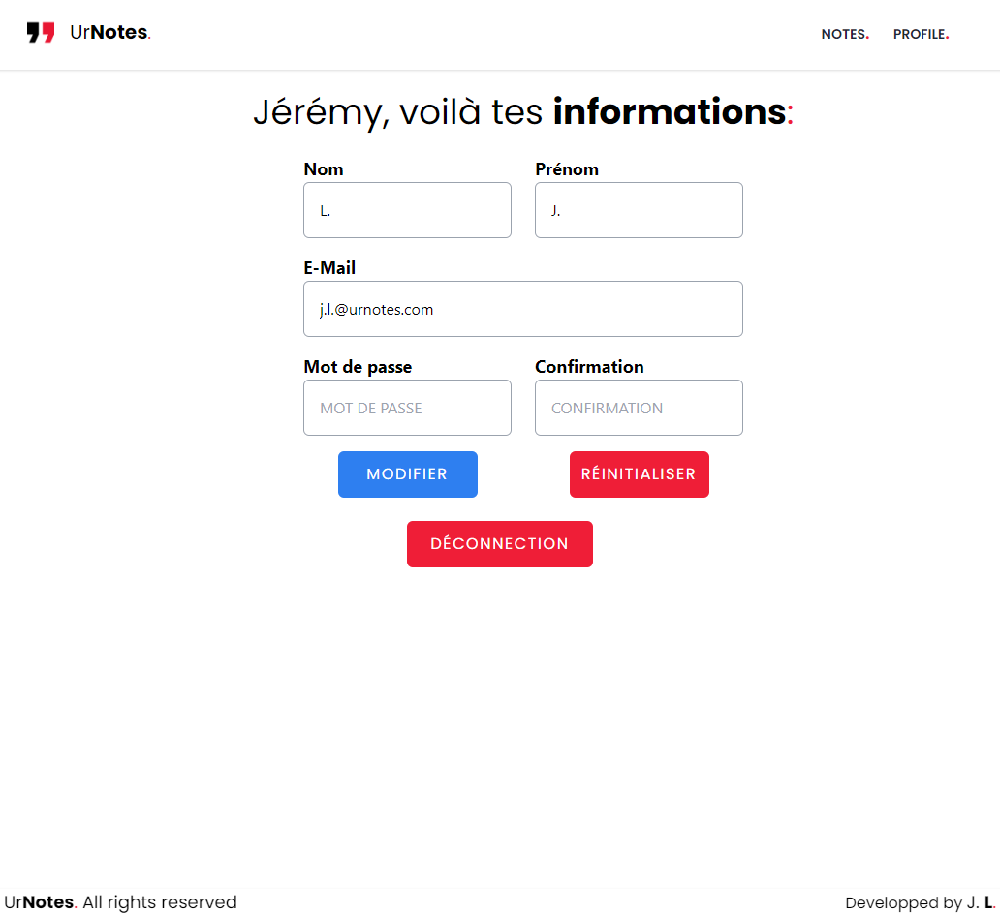
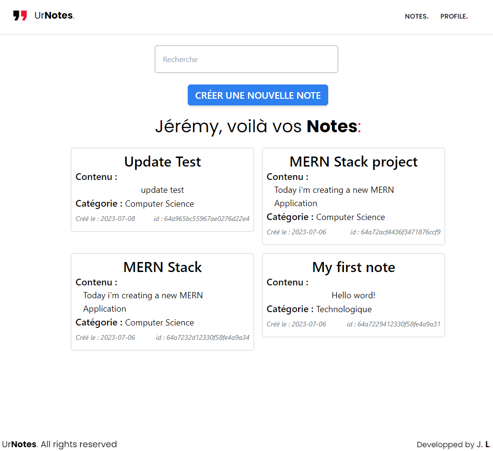

# UrNotes Application using MERN Stack

The main goal of this project is to learn about MERN technical stack.

The aim of this project is to create a notes site with a user system.
In other words, a CRUD system for notes and an AUTH system for users.

For this project, I followed the [RoadsideCoder](https://www.youtube.com/@RoadsideCoder)'s YouTube [Playlist](https://www.youtube.com/playlist?list=PLKhlp2qtUcSYC7EffnHzD-Ws2xG-j3aYo), taking a few liberties.

So, what is MERN ?

## Technical Stack

MERN is a technical stack that uses the following technologies :

> - [MongoDB](https://www.mongodb.com/) : Document-oriented NoSQL database management system.
> - [ExpressJS](https://expressjs.com/) : Web application Framework for NodeJS.
> - [ReactJS](https://react.dev/) : Open-source JS library for building UIs.
> - [NodeJS](https://nodejs.org/en) : Open-source cross-platform JS runtime envirronment.

### Front-End :

> - [TailwindCSS](https://tailwindcss.com/) : CSS Framework to simplify front-end design.
> - [Redux](https://redux.js.org/) : Open-source JS library for centralized status management.

### Back-End :

> - [Mongoose](https://mongoosejs.com/) : MongoDB object modeling for NodeJS.
> - [BcryptJS](https://www.npmjs.com/package/bcrypt) : Hash password library.
> - [JSONWebToken](https://www.npmjs.com/package/jsonwebtoken) : JSON Web Token generator.

### Other Tools :

> - [Postman](https://www.postman.com/) : API platform for building and using APIs.

## Various pages

### - Landing page :

A **landing page** should make users want to use the application.
However, I wanted to focus on the implementation of **functionalities**.

**_Picture 1 :_** Landing page.

Firstly, by **registering** and **logging** in users, and **updating** their information.

### - Registering / logging & Profile pages :

**Registering** and **logging pages** are pages with form to **create** user in the MongoDB database, **update** those information through ProfilePage, and finally **retrieve** information to log the user.

**_Picture 2 :_** Register page.

**_Picture 3 :_** Login page.

Secondly, **CRUD** functionality for the notes model.

### - CRUD pages :

First of all, what's CRUD system ?

**CRUD**, which means **C**reate **R**etrieve **U**pdate **D**elete, are the main functions for managing a model.

**_Picture 4 :_** Profil page.

**_Picture 5 :_** Notes page.

On this page, we can find all the notes of the logged-in user, as well as a filter function by name.

## ENV File example

> PORT = 5000
>
> MONGO_URI = _link_
>
> NODE_ENV = development
>
> JWT_SECRET = _word_
